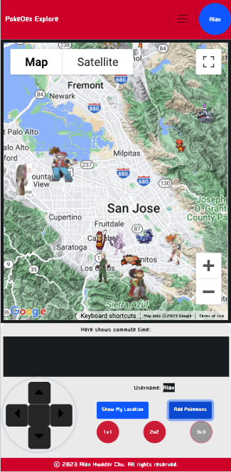
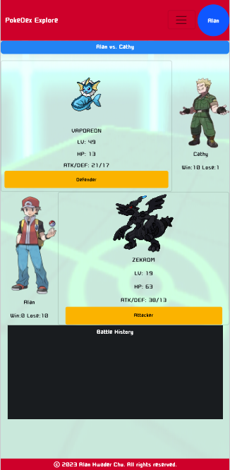

# Pokedex Explore APP
- Project description: 
This project is a Pokedex app that allows you to capture pokemons, make comments on your porkemons, and battle with other players. 

- Tech stack:
    - Frontend: React,JavaScriprt, Jinja, HTML, CSS, Bootstrap
    - Backend: Python, Flask, SQLAlchemy, PostgreSQL
    - API: [PokeAPI](https://pokeapi.co/), [Google Maps JavaScript API](https://developers.google.com/maps/documentation/javascript)
    - Deployment: AWS Lightsail

- Features: 
    - User can register/login/logout, and view their profile
    - User can uplaod their profile picture and edit their profile
    - User can get pokemons from Professor Oak in his lab
    - User can capture pokemons in the Google Map(area Bay Area)
    - User can move thier icon to the where they want to caputre pokemons(Manully or follow the route)
    - User can view the pokemons they have captured
    - User can release their pokemons
    - User can add/edit/delete comments on their pokemons
    - User can battle with other players(1v1, 2v2, 3v3)
- Deploy
    - This app is deployed on AWS Lightsail. [Click to Play](http://35.89.131.33/)
- Screenshots
    - Desktop/Ipad view
        - Google Map

            
            
        - Player List

             
        - Battle 

            
    - Mobile view (Only point out the difference) pages
        - Google Map/Battle

            
            

