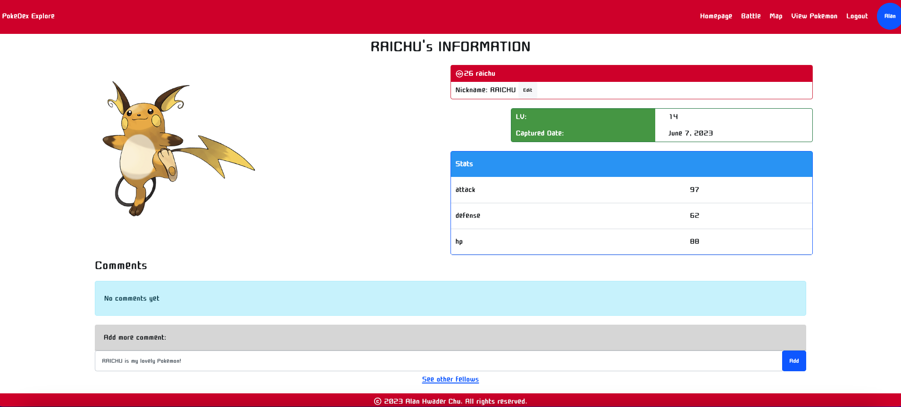
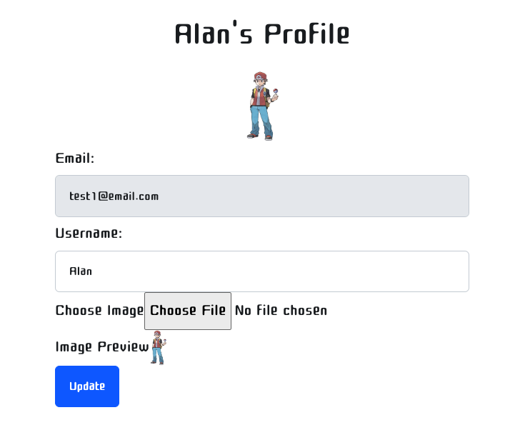

# Pokedex Explore
This app is deployed on AWS Lightsail. [Click to Play](http://44.224.223.55/)

Learn more about the developer! [ LinkedIn](https://www.linkedin.com/in/alan-hwader-chu/)

## Project description: 
Introducing Pokedex Explore, a top-notch full-stack web application crafted for Pokemon enthusiasts worldwide. Dive into a unique Pokemon adventure in the Bay Area and engage with over a thousand diverse Pokemon.

With the Pokemon API, I've paired Google Maps for an interactive hunting experience. Traverse the Bay Area's landscapes, capture your favourite Pokemon, and engage in electrifying battles, from tactical 1v1 matches to thrilling 3v3 showdowns.

Pokedex Explore isn't just about catching Pokemon; it's a celebration of your journey. Leave comments, share your stories, cherish your victories, and trace your path as a Pokemon Trainer.

Don't wait. Begin your extraordinary Pokemon adventure with Pokedex Explore today!

## Tech Stack
**Frontend:** [React](https://reactjs.org/), [JavaScript](https://www.javascript.com/), [Jinja](https://palletsprojects.com/p/jinja/), [HTML](https://developer.mozilla.org/en-US/docs/Web/HTML), [CSS](https://developer.mozilla.org/en-US/docs/Web/CSS), [Bootstrap](https://getbootstrap.com/)

**Backend:** [Python](https://www.python.org/), [Flask](https://flask.palletsprojects.com/en/2.0.x/), [SQLAlchemy](https://www.sqlalchemy.org/), [PostgreSQL](https://www.postgresql.org/)

**Media Handling:** [Cloudinary](https://cloudinary.com/)

**APIs:** [PokeAPI](https://pokeapi.co/), [Google Maps JavaScript API](https://developers.google.com/maps/documentation/javascript)

**Deployment:** [AWS Lightsail](https://aws.amazon.com/lightsail/)

## Features:
### First Capture
Once signed in, you can visit Professor Oak's lab to receive your first Pokemon. You can choose from a list of starter Pokemon, including Bulbasaur, Charmander, Squirtle, and Pikachu.

Once you have selected your Pokemon, click ***I want you*** to secure your Pokemon. You are sending a post request including Pokemon's ID to the backend. The backend will create a new Pokemon for you and add it to your Pokemon list.After you've captured your first Pokemon, Professor Oak will introduce you the featrues of this app. 

### Capture more Pokemons on the Map
Kickstart your adventure by clicking ***Map*** to unveil the landscape. Start by showcasing your current location with the ***Show My Location*** button (note: for this version, all trainers are located in Sunnyvale). Discover the Pokemons inhabiting the Bay Area by clicking ***Add Pokemons***, which sends a GET request to the backend, triggering a random generation of Pokemon, freshly rendered on your map.. Once you've set your eyes on a target, hit ***Cal Commute Time*** to gauge your travel time. With the location of you and pokemons, Google Map will proivide a direction service.  When ready to embark, click ***Go*** and prepare to capture your Pokemon. Google Maps will seamlessly guide your journey, offering automated directions to your destination. For those preferring manual control, you can navigate using the on-screen controller.
As you reach your destination, the final step awaits – click ***Capture*** to secure your Pokemon. Your journey into the world of Pokemon begins now!

Click the red button 1v1, 2v2, 3v3. You can see where are other trainers. Click the trainer icon, you can see the trainer's profile. Click the ***Battle*** button, you can start a battle with the trainer.

### View your Pokemons and see the detail of your Pokemon
You can view your Pokemons in ***View Pokemons*** page. You can also release your Pokemons here. As you release your Pokemons, the backend will delete the Pokemon from your Pokemon list.

Click the image of your pokemon, you will br redirected ot the detail page of your pokemon. You can see the detail of your pokemon and the comments of your pokemon. You can edit your pokemon's nickname and add some comments here. Who is your favorite Pokemon? What is your favorite Pokemon's nickname? Write it down here!

### Battle with other trainers/players
When you've assembled a worthy team of Pokemon, it's time to pit them against fellow trainers. Click Battle to scan through other players on the app, assessing their tenure and win rate. Next, decide on the scale of the battle, with ***1v1***, ***2v2***, and ***3v3*** options available.
Once the battle format is selected, ***Let's Battle***buttons surrounding the players become clickable – your invitation to battle. On accepting the challenge, a GET request is sent, containing the number of Pokemon you've chosen to battle with and the player you're challenging. The backend then randomly selects Pokemon from both your and your opponent's rosters, setting the stage for the clash. You'll be redirected swiftly to the battlefield.

In the battle page, you'll discover details about your Pokemon and your opponent's Pokemon. Strategically select your attacker and defender by clicking the ***Attacker***,  ***Defender*** buttons, considering the unique stats of each Pokemon. Damage calculations are performed based on these stats, resulting in an immersive and tactical battle experience. After your attack, your opponent will retaliate, intensifying the back-and-forth nature of the battle.

To keep track of the battle progress, a textarea is available to record the battle process, allowing you to monitor the damage inflicted on both your Pokemon and your opponent's Pokemon. This feature enables you to strategize and adjust your battle plan accordingly.

React is  employed to dynamically update the HP (Hit Points) of each Pokemon in real-time after every attack, ensuring a seamless and engaging battle interface. Additionally, CSS animations are applied to infuse the battles with excitement and enhance your overall experience.

The battle reaches its conclusion when either all of your Pokemon or all of your opponent's Pokemon have fainted. Subsequently, you'll be seamlessly redirected to the battle result page. Here, you'll have the opportunity to update your win rate and leave comments about the battle. AJAX POST/PUT requests are utilized to facilitate win rate updates and comment submissions, enabling you to actively participate in shaping your Pokemon Trainer reputation.

### Profile
#### Signup and Login
Feel free to join our community! Click ***Signup*** to sign up.
Make sure upload your personal avatar. You can upload your avatar from your device. The backend will send a post request to Cloudinary to upload your avatar. The backend will receive the url of your avatar and store it in the database. If you don't upload your avatar, the default avatar will be used(A Mewtwo).

#### Edit profile
In the top-right corner of the navigation bar, you'll find a button that reveals additional information about you. Clicking on this button will lead you to a page where you can view and edit your profile. In the ***Edit Profile page***, you have the option to modify your username and upload a new profile photo, allowing you to personalize and update your profile according to your preferences.

## Acknowledgments
I would like to express our sincere appreciation to the following organizations and individuals for their contributions and support in the development of this project:

- Hackbright Academy: Thank you for providing the training and resources that empowered us to undertake this project.
- Instructional Team: We are grateful to Ray Traina-Grandon, Sean Moriarty, and Katarzyna Jablonski for their guidance, feedback, and assistance throughout the development process.
- Walmart: We would like to express our gratitude for their generous sponsorship, which enabled us to bring this project to fruition.

Without the support of Hackbright Academy, the instructional team, and Walmart, this project would not have been possible. Thank you all for your invaluable contributions!

